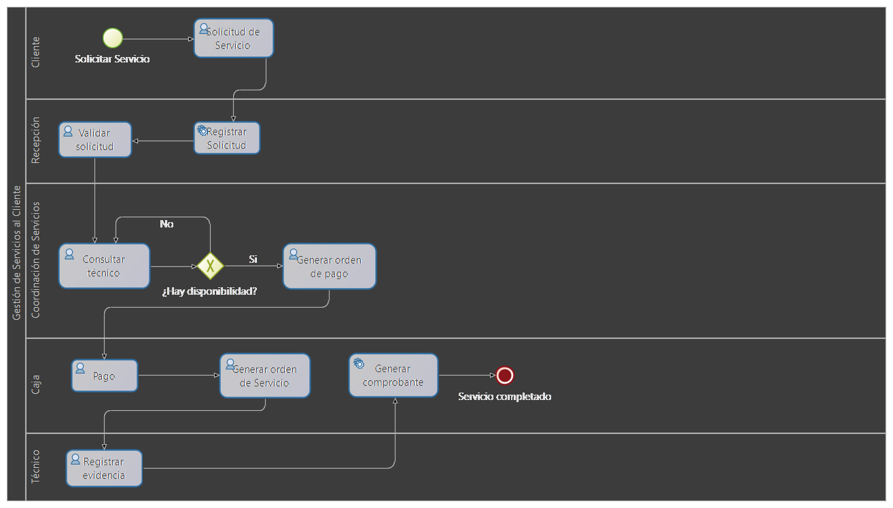

# Modelado BPMN del Proceso de Gestión de Servicios al Cliente en Sodimac

## Descripción

Este proyecto corresponde al **Laboratorio 05** de la asignatura de Desarrollo de Software Empresarial. Su propósito es modelar y documentar el proceso de **Gestión de Servicios al Cliente** de la empresa **Sodimac** utilizando la notación **BPMN (Business Process Model and Notation)**.

El modelo representa el flujo de actividades desde que un cliente solicita un servicio hasta que este es completado, mostrando la interacción entre las áreas involucradas, los puntos de decisión y los documentos generados durante el proceso.

---

## Objetivos

- Modelar el proceso de Gestión de Servicios al Cliente utilizando BPMN 2.0.
- Identificar las actividades, eventos, decisiones y actores que participan en el proceso.
- Analizar el flujo de trabajo entre las diferentes áreas de la empresa.
- Aplicar los conceptos de modelado de procesos de negocio en un caso empresarial.
- Documentar el proceso para facilitar su comprensión y análisis.

---

## Empresa seleccionada

**Empresa:** Sodimac Perú

**Sitio web:** https://www.sodimac.com.pe

---
### Descripción

Sodimac es una empresa dedicada a la comercialización de productos para el hogar, la construcción y el mejoramiento de espacios. Además de la venta de productos, ofrece diversos servicios complementarios como instalaciones, armado de muebles, corte de materiales y otros servicios especializados orientados a satisfacer las necesidades de sus clientes.

---

## Proceso modelado

**Gestión de Servicios al Cliente**

El proceso representa la atención de una solicitud de servicio realizada por un cliente y comprende las actividades necesarias para validar la solicitud, coordinar la atención, gestionar el pago y finalizar el servicio.

---
## Integrantes

- Quinteros Condori Jesus Salvador
- Coloma Yujra Riki Santher
---
## Funcionamiento del proceso

El flujo del proceso modelado en BPMN se desarrolla de la siguiente manera:

1. **Inicio del proceso.**
   El proceso comienza cuando un cliente solicita un servicio ofrecido por Sodimac.

2. **Registro de la solicitud.**
   El área de **Recepción** registra la información proporcionada por el cliente en el sistema.

3. **Validación de la solicitud.**
   Una vez registrada, la solicitud es revisada para verificar que toda la información requerida sea correcta y que el servicio pueda ser atendido.

4. **Consulta de disponibilidad del técnico.**
   La **Coordinación de Servicios** verifica si existe un técnico disponible para realizar el servicio solicitado.

5. **Decisión de disponibilidad.**
   - Si **no existe disponibilidad**, el proceso permanece en espera hasta contar con un técnico disponible.
   - Si **existe disponibilidad**, el proceso continúa con la generación de la orden de pago.

6. **Generación de la orden de pago.**
   Se genera la orden correspondiente para que el cliente pueda realizar el pago del servicio.

7. **Pago del servicio.**
   El cliente realiza el pago en el área de **Caja**, confirmando la contratación del servicio.

8. **Generación de la orden de servicio.**
   Una vez registrado el pago, se emite la orden de servicio que autoriza la ejecución del trabajo.

9. **Registro de evidencias.**
   El técnico registra las evidencias correspondientes al servicio realizado, dejando constancia de la atención efectuada.

10. **Generación del comprobante.**
    Finalmente, el sistema genera el comprobante del servicio prestado.

11. **Fin del proceso.**
    El proceso concluye cuando el servicio ha sido registrado correctamente y se alcanza el evento **"Servicio completado"**.

---

## Diagrama BPMN

A continuación se presenta el diagrama BPMN correspondiente al proceso de **Gestión de Servicios al Cliente** de Sodimac.

  

*Figura 1. Diagrama BPMN del proceso de Gestión de Servicios al Cliente.*

---

## Roles involucrados

- Cliente
- Recepción
- Coordinación de Servicios
- Caja
- Técnico

---

## Entradas del proceso

- Solicitud de servicio.
- Datos del cliente.
- Información del servicio requerido.

---

## Salidas del proceso

- Orden de pago.
- Orden de servicio.
- Evidencias del servicio.
- Comprobante emitido.
- Servicio completado.

---

## Herramientas utilizadas

- BPMN 2.0
- Bonita Studio Community
- Git

---
- GitHub

---
